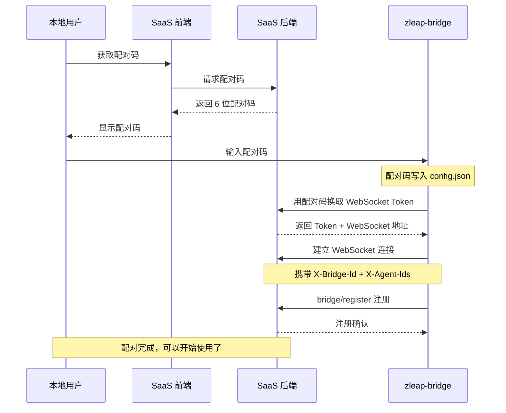

# zleap-bridge

> 本地 AI Agent 桥接器 — 将本地 Agent 能力通过 WebSocket 隧道暴露给云端 SaaS 平台

- **作者**：Lzm
- **日期**：2026-07-13
- **版本**：v0.3.0
- **语言**：Go 1.26+
- **编码**：UTF-8

---

## 目录

1. [项目概述](#1-项目概述)
2. [整体架构](#2-整体架构)
3. [SaaS 通讯规则](#3-saas-通讯规则)
4. [本地 Agent 检索规则](#4-本地-agent-检索规则)
5. [对接规则](#5-对接规则)
6. [核心数据流](#6-核心数据流)
7. [配置体系](#7-配置体系)
8. [启动方式](#8-启动方式)
9. [使用手册](#9-使用手册)

---

## 1. 项目概述

zleap-bridge 是一个本地 AI Agent 桥接器，核心使命是：

> **扫描本地安装的 AI Agent（如 Claude Code、Codex、Kimi、OpenCode、Gemini CLI、GitHub Copilot、pi、Cursor、GLM Agent、OpenClaw、Hermes Agent），通过标准化协议将它们暴露出来，使云端 SaaS 平台可以远程调用本地的 Agent 能力。**

它解决了两个关键问题：

1. **协议统一**：不同的 AI Agent 各有各自的启动方式和通信协议，zleap-bridge 统一通过 ACP 协议与它们通信，屏蔽底层差异。
2. **远程可达**：本地 Agent 运行在用户的个人电脑上（NAT 内网），云端无法直接访问。zleap-bridge 通过 WebSocket 隧道与 SaaS 建立反向连接，使得 SaaS 可以像调用本地服务一样调用用户的 Agent。

---

## 2. 整体架构

### 2.1 分层结构

系统分为四层，自底向上：

```
┌──────────────────────────────────────────────────────────────────────┐
│                          SaaS 平台（云端）                             │
│  负责：用户管理、配对码生成、请求分发、结果聚合、前端 WebSocket 推送    │
└──────────────────────────┬───────────────────────────────────────────┘
                           │ WebSocket JSON-RPC
                           │ JSON-RPC 2.0 over WebSocket
                           ▼
┌──────────────────────────────────────────────────────────────────────┐
│                    Tunnel Layer — 隧道层                               │
│                                                                      │
│  ┌─────────────────┐    ┌─────────────────────┐    ┌──────────────┐  │
│  │ WSClient        │    │ TunnelService       │    │ 自动重连      │  │
│  │ (gorilla/ws)    │───▶│ 协议桥接核心         │───▶│ 5s间隔       │  │
│  │ 发送/接收JSON   │    │ 协议转换（WebSocket↔ACP）        │    │ 无限重试     │  │
│  └─────────────────┘    └──────────┬──────────┘    └──────────────┘  │
└────────────────────────────────────┼──────────────────────────────────┘
                                     │ 路由分发
                                     ▼
┌──────────────────────────────────────────────────────────────────────┐
│                    Router Layer — 路由层                               │
│                                                                      │
│  ┌──────────────────────────────────────────────────────────────┐    │
│  │  RequestRouter                                               │    │
│  │  ┌──────────┐ ┌───────────┐ ┌──────────┐                      │    │
│  │  │ invoke   │ │sessions/  │ │sessions/ │                      │    │
│  │  │ Agent调用 │ │list 列表  │ │messages  │                      │    │
│  │  └──────────┘ └───────────┘ └──────────┘                      │    │
│  └──────────────────────────────────────────────────────────────┘    │
│  ┌──────────────────────────────────────────────────────────────┐    │
│  │  SessionManager — 会话管理器                                   │    │
│  │  会话创建/恢复/持久化(3次重试+指数退避) + 消息存储到磁盘      │    │
│  └──────────────────────────────────────────────────────────────┘    │
└────────────────────────────────────┬──────────────────────────────────┘
                                     │ ACP 协议 (Agent Communication Protocol)
                                     │ JSON-RPC 2.0 over stdin/stdout
                                     ▼
┌──────────────────────────────────────────────────────────────────────┐
│                    Agent Layer — Agent 层                             │
│                                                                      │
│  ┌──────────────────────────────────────────────────────────────┐    │
│  │  AgentRegistry — Agent 注册表                                 │    │
│  │  Discover() → 扫描 PATH / npm 全局 / 专用安装路径             │    │
│  │  发现后自动启动，后台 goroutine 管理进程生命周期               │    │
│  └──────────────────────────────────────────────────────────────┘    │
│                                                                      │
│  ┌──────────────┐ ┌──────────┐ ┌──────┐ ┌──────────┐              │
│  │  Claude Code │ │ Codex CLI│ │ Kimi │ │ OpenCode │              │
│  │  claude-     │ │ codex-acp│ │ kimi │ │ opencode │              │
│  │  agent-acp   │ │ wrapper  │ │ acp  │ │ acp      │              │
│  └──────────────┘ └──────────┘ └──────┘ └──────────┘              │
│  ┌──────────────┐ ┌──────────────┐ ┌──────────────┐ ┌──────────────┐ ┌──────────────┐ ┌──────────────┐ ┌──────────────┐│
│  │  Gemini CLI  │ │ GitHub       │ │  pi          │ │  Cursor      │ │  GLM Agent   │ │  OpenClaw    │ │  Hermes      ││
│  │  gemini --   │ │ Copilot CLI  │ │  pi-acp      │ │  agent acp   │ │  glm-acp-    │ │  openclaw    │ │  Agent       ││
│  │  experimental│ │ copilot --acp│ │  (pi rpc     │ │              │ │  agent       │ │  acp (       │ │  hermes acp  ││
│  │  -acp        │ │              │ │   bridge)    │ │              │ │              │ │  Gateway桥)  │ │              ││
│  └──────────────┘ └──────────────┘ └──────────────┘ └──────────────┘ └──────────────┘ └──────────────┘ └──────────────┘│
│                                                                      │
│  ┌──────────────────────────────────────────────────────────────┐    │
│  │  baseAgent — 公共基础实现                                     │    │
│  │  进程管理 + ACP读写 + 握手 + 会话创建 + 流式读取协程         │    │
│  └──────────────────────────────────────────────────────────────┘    │
└──────────────────────────────────────────────────────────────────────┘

         ┌──────────────────────────────────────────────────┐
         │          Admin HTTP 服务 (端口 9202)               │
         │  /health   /agents   /api/sessions               │
         │  /api/messages   /ws/admin  (WebSocket 管理接口)  │
         │  /test_acp.html  /test_saas.html (测试界面)       │
         └──────────────────────────────────────────────────┘
```

### 2.2 核心设计理念

- **两协议桥接**：本地 Agent 使用 ACP（JSON-RPC 2.0 over stdin/stdout），云端通过 WebSocket 使用 JSON-RPC 2.0，zleap-bridge 作为两者之间的协议转换层。
- **无侵入式接入**：不修改本地 Agent 的任何代码，Agent 本身不知道 bridge 的存在。
- **即插即用**：启动 bridge 后自动扫描 PATH 目录发现已安装的 Agent，无需手动配置。

---

## 3. SaaS 通讯规则

### 3.1 协议基础

- **协议**：JSON-RPC 2.0 over WebSocket
- **底层库**：gorilla/websocket
- **心跳**：每 30 秒 Ping 帧
- **读取超时**：60 秒
- **自动重连**：5 秒间隔，无限重试

### 3.2 连接建立

Bridge 连接 SaaS WebSocket 时携带以下 HTTP Header：

| Header | 说明 | 示例值 |
|--------|------|--------|
| `X-Bridge-Id` | Bridge 唯一标识 | `bridge_xxxxx` |
| `X-Agent-Ids` | 可用 Agent 列表（逗号分隔） | `claude-code,kimi` |
| `Authorization` | 配对获取的 Token | `Bearer ws_token_xxx` |

### 3.3 消息类型全集

| 方向 | Method | 触发时机 | 说明 |
|------|--------|---------|------|
| Bridge → SaaS | `bridge/register` | 连接建立后 | 注册 Bridge 身份和可用 Agent 列表 |
| SaaS → Bridge | `invoke` | 用户发起请求 | 调用指定 Agent 的指定方法 |
| Bridge → SaaS | `session/update` | Agent 流式输出 | 实时推送思考/回复片段 |
| Bridge → SaaS | `invoke` 的响应 | Agent 处理完成 | 最终调用结果（流式模式也会发送） |
| SaaS/Bridge Admin | `sessions/list` | 查询会话列表 | 列出指定 Agent 的所有会话（可通过 TunnelService 或 Admin WS 调用） |
| SaaS/Bridge Admin | `sessions/messages` | 查询会话消息 | 列出指定会话的消息历史（可通过 TunnelService 或 Admin WS 调用） |
| SaaS → Bridge | `ping` | 主动探测链路 | 应用层心跳检测 |
| Bridge → SaaS | `pong` | 收到 ping 后 | 心跳回复 |

> **注意**：应用层 `ping`/`pong` 方法与 WebSocket 协议层的 Ping 帧（gorilla/websocket 内建，每 30 秒自动发送）独立工作，互不干扰。

### 3.4 关键消息格式

**bridge/register（Bridge → SaaS）**：

```json
{
  "jsonrpc": "2.0",
  "method": "bridge/register",
  "params": {
    "bridge_id": "bridge_xxxxx",
    "agents": [
      {"agent_id": "claude-code", "display_name": "Claude Code", "status": "idle"},
      {"agent_id": "kimi", "display_name": "Kimi", "status": "idle"}
    ]
  }
}
```

**invoke（SaaS → Bridge）**：

```json
{
  "jsonrpc": "2.0",
  "id": "req_001",
  "method": "invoke",
  "params": {
    "agent_id": "kimi",
    "method": "session/prompt",
    "params": {
      "sessionId": "sess_xxxx",
      "prompt": [{"type": "text", "text": "Hello"}]
    }
  }
}
```

支持的 method 值：`session/new`、`session/load`、`session/prompt`

**session/update（Bridge → SaaS，流式推送）**：

```json
{
  "jsonrpc": "2.0",
  "method": "session/update",
  "params": {
    "request_id": "req_001",
    "type": "response",
    "content": {"text": "正在思考..."}
  }
}
```

type 取值：`thought`（思考过程）、`response`（回复片段）、`final`（最终结果）、`error`（错误）、`session_invalid`（会话失效）、`session_refreshed`（会话已刷新）

| type | 说明 |
|------|------|
| `thought` | Agent 的思考过程片段（流式推送） |
| `response` | Agent 的回复片段（流式推送） |
| `final` | 最终结果（Codex 流式完成时推送） |
| `error` | 流式处理出错 |
| `session_invalid` | 当前 session 已失效（Agent 内部超时或异常退出），需重新创建 |
| `session_refreshed` | Bridge 自动创建了新 session 并替换了旧 session，携带新 sessionId |

**invoke 响应（Bridge → SaaS）**：

```json
{
  "jsonrpc": "2.0",
  "id": "req_001",
  "result": {"text": "最终回复内容..."}
}
```

错误响应：

```json
{
  "jsonrpc": "2.0",
  "id": "req_001",
  "error": {"code": -31001, "message": "未知 Agent: xxx"}
}
```

**session/load 成功响应（Bridge → SaaS）**：

当 SaaS 请求加载已有会话时，Bridge 返回会话状态和历史消息：

```json
{
  "jsonrpc": "2.0",
  "id": "req_001",
  "result": {
    "status": "ok",
    "sessionId": "sess_xxx",
    "messages": [
      {"role": "user", "text": "你好"},
      {"role": "assistant", "text": "你好！有什么可以帮助你的？"}
    ]
  }
}
```

### 3.5 错误码定义

| 错误码 | 说明 |
|--------|------|
| `-32700` | 参数解析失败 |
| `-32601` | 未知方法 |
| `-31001` | 未知 Agent |
| `-31002` | Agent 启动失败 |
| `-31003` | Agent 不支持该方法 |
| `-31004` | 创建会话失败 |
| `-31005` | 加载会话失败 |
| `-31006` | 获取会话失败 |
| `-31007` | 发送 prompt 失败 |
| `-31008` | Agent 响应错误 |
| `-31009` | Agent 返回未知响应 |

### 3.6 sessions/list 协议格式

`sessions/list` 是 Admin WebSocket API 方法，用于查询指定 Agent 的历史会话列表。

**请求格式**：

```json
{
  "jsonrpc": "2.0",
  "id": "1",
  "method": "sessions/list",
  "params": {
    "agent_id": "kimi"
  }
}
```

`agent_id` 为可选参数，不传时返回所有 Agent 的会话。

**响应格式**：

```json
{
  "jsonrpc": "2.0",
  "id": "1",
  "result": [
    {
      "agent_id": "kimi",
      "session_id": "sess_xxx",
      "message_count": 5,
      "updated_at": 1790000000
    }
  ]
}
```

| 字段 | 类型 | 说明 |
|------|------|------|
| `agent_id` | string | Agent 标识 |
| `session_id` | string | 会话 ID |
| `message_count` | int | 消息数量（仅持久化会话） |
| `updated_at` | int | 最后更新时间戳（仅持久化会话） |

---

## 4. 本地 Agent 检索规则

### 4.1 发现策略

扫描路径包括系统 PATH 和平台特定搜索目录（详见 [registry.go](internal/agent/registry.go)）：

**通用路径**：
```
系统 PATH 环境变量中的所有目录
当前工作目录
~/.local/bin（跨平台，Cursor CLI 安装位置）
```

**Windows 额外路径**：
```
%APPDATA%\npm
%LOCALAPPDATA%\npm
npm root -g 命令返回值
%LOCALAPPDATA%\OpenAI\Codex\bin\{version}\（Codex 专用安装路径）
%LOCALAPPDATA%\Cursor（Cursor CLI 安装位置）
```

**macOS 额外路径**：
```
/usr/local/bin
/opt/homebrew/bin
~/.npm-global/bin
~/.volta/bin
~/.local/bin
```

### 4.2 候选 Agent 列表

| Agent ID | 可执行文件 | 启动参数 | ACP 支持方式 | 对接状态 |
|----------|-----------|---------|-------------|:-------:|
| `claude-code` | `claude-agent-acp` | (无) | 内置 ACP（npm wrapper） | ✅ 已对接 |
| `codex` | `codex-acp`（优先）或 `codex` | (无) | Wrapper（`@agentclientprotocol/codex-acp`） | ✅ 已对接 |
| `kimi` | `kimi` | `["acp"]` | 内置 ACP（子命令） | ✅ 已对接 |
| `opencode` | `opencode` | `["acp"]` | 内置 ACP（子命令） | ✅ 已对接 |
| `gemini` | `gemini` | `["--experimental-acp"]` | 内置 ACP（标志位） | 🚧 开发中 |
| `copilot` | `copilot` | `["--acp"]` | 内置 ACP（标志位） | 🚧 开发中 |
| `pi` | `pi-acp` | (无) | ACP 适配器（`pi --mode rpc` 桥接） | 🚧 开发中 |
| `cursor` | `agent` | `["acp"]` | 内置 ACP（子命令） | 🚧 开发中 |
| `glm` | `glm-acp-agent` | (无) | ACP Agent（GLM Coding Plan） | 🚧 开发中 |
| `openclaw` | `openclaw` | `["acp"]` | ACP 桥接（→ OpenClaw Gateway） | 🚧 开发中 |
| `hermes` | `hermes` | `["acp"]` | ACP 适配器（Python，需安装 `.[acp]`） | 🚧 开发中 |

> **对接状态说明**：
> - **✅ 已对接** — ACP 握手 → 会话创建 → 对话 → 消息历史 → 会话加载 全链路测试通过
> - **🚧 开发中** — Agent 已发现并注册，但需补充配置（API Key / 登录认证 / 外部服务）后方可完成全链路对接

### 4.3 自动安装机制

对于 Codex，如果发现 `codex.exe` 但未检测到 `codex-acp` wrapper，会自动执行：

```bash
npm install --prefix %TEMP%\.npm-global -g @agentclientprotocol/codex-acp
```

安装成功后自动将 `%TEMP%\.npm-global` 加入搜索路径。

### 4.4 Windows 兼容处理

| Agent | 已知问题 | 解决方案 |
|-------|---------|---------|
| **Codex** | Windows EPERM 无法写入 `~/.codex/` 下的 SQLite | 重定向 `CODEX_HOME` → `%TEMP%/codex-home`，复制已有数据 |
| **Kimi** | Windows `fs.mkdir` EPERM 无法创建 `~/.kimi-code/sessions` | 重定向 `HOME/USERPROFILE` → `%TEMP%/kimi-home`，复制 credentials/config/device_id |

### 4.5 新增 Agent 对接详情

> 每个 Agent 的详细对接文档见 [docs/agents/](docs/agents/) 目录。

以下记录了新增 Agent 的对接信息，包括安装、认证、启动参数和注意事项。

#### 4.5.1 `gemini` — Gemini CLI

| 项目 | 内容 |
|------|------|
| **Agent ID** | `gemini` |
| **安装方式** | `npm install -g @google/gemini-cli` |
| **可执行文件** | `gemini` |
| **启动参数** | `["--experimental-acp"]` |
| **ACP 方式** | 内置 ACP（标志位） |
| **认证** | `GEMINI_API_KEY` 环境变量 |
| **注意事项** | `--experimental-acp` 标志为实验性功能，随 Google Gemini CLI 版本更新可能变化 |
| **平台兼容** | macOS ✅ / Windows ✅（npm 全局安装） |

#### 4.5.2 `copilot` — GitHub Copilot CLI

| 项目 | 内容 |
|------|------|
| **Agent ID** | `copilot` |
| **安装方式** | `gh extension install github/gh-copilot`（gh ≥ 2.96 已内置，无需额外安装） |
| **可执行文件** | `copilot`（位于 `%LOCALAPPDATA%\GitHub CLI\copilot\`） |
| **启动参数** | `["--acp"]` |
| **ACP 方式** | 内置 ACP（标志位） |
| **认证** | GitHub 账号登录（首次使用需运行 `copilot login` 完成 OAuth 认证） |
| **前置依赖** | GitHub CLI（`gh`）— `winget install GitHub.cli` 或 https://cli.github.com |
| **注意事项** | `@github/copilot-cli` npm 包已废弃，改由 `gh copilot` 命令管理；`--acp` 使用 stdio 模式，不使用默认的 PTY 模式 |
| **平台兼容** | macOS ✅ / Windows ✅ |

#### 4.5.3 `pi` — pi Coding Agent

| 项目 | 内容 |
|------|------|
| **Agent ID** | `pi` |
| **安装方式** | `npm install -g @earendil-works/pi-coding-agent`（pi 本体） + `npm install -g pi-acp`（ACP 适配器） |
| **可执行文件** | `pi-acp` |
| **启动参数** | (无) |
| **ACP 方式** | ACP 适配器（内部启动 `pi --mode rpc` 并桥接 ACP） |
| **认证** | 自有配置 `~/.pi/agent/settings.json`，无需额外环境变量 |
| **注意事项** | pi-acp 是一个桥接进程，内部自动启动 pi 的 RPC 模式；需同时安装 pi-coding-agent 和 pi-acp 两个包 |
| **平台兼容** | macOS ✅ / Windows ✅ |

#### 4.5.4 `cursor` — Cursor CLI

| 项目 | 内容 |
|------|------|
| **Agent ID** | `cursor` |
| **安装方式** | macOS/Linux: `curl https://cursor.com/install -fsS \| bash`；Windows: `irm 'https://cursor.com/install?win32=true' \| iex` |
| **可执行文件** | `agent`（注意不是 `cursor`，是独立的 `agent` 二进制） |
| **启动参数** | `["acp"]` |
| **ACP 方式** | 内置 ACP（子命令） |
| **认证** | `CURSOR_API_KEY` 或 `CURSOR_AUTH_TOKEN` 环境变量，或先运行 `agent login` 完成认证 |
| **安装路径** | macOS: `~/.local/bin/agent`；Windows: `%LOCALAPPDATA%\Cursor` |
| **注意事项** | 可执行文件名为 `agent` 而非 `cursor`，与其他 Agent 不同；搜索路径已添加 `~/.local/bin` |
| **平台兼容** | macOS ✅ / Windows ✅ |

#### 4.5.5 `glm` — GLM ACP Agent

| 项目 | 内容 |
|------|------|
| **Agent ID** | `glm` |
| **安装方式** | `npm install -g glm-acp-agent` |
| **可执行文件** | `glm-acp-agent`（全局安装后）或 `npx glm-acp-agent@latest` |
| **启动参数** | (无) |
| **ACP 方式** | ACP Agent（TypeScript 实现，Node.js 运行时） |
| **认证** | `Z_AI_API_KEY` 环境变量，或 `glm-acp-agent --setup` 交互式配置（写入 `~/.config/glm-acp-agent/credentials.json`） |
| **API 申请** | https://z.ai/manage-apikey/apikey-list |
| **模型列表** | `glm-5.1`（默认）、`glm-5-turbo`、`glm-4.7`、`glm-4.5-air` |
| **注意事项** | 需要 Node.js ≥ 20；使用智谱 AI Coding Plan 端点（`https://api.z.ai/api/coding/paas/v4`），并非通用 API |
| **平台兼容** | macOS ✅ / Windows ✅ |

#### 4.5.6 `hermes` — Hermes Agent

| 项目 | 内容 |
|------|------|
| **Agent ID** | `hermes` |
| **安装方式** | `pip install hermes-agent` + `pip install -e '.[acp]'` |
| **可执行文件** | `hermes`（ACP 模式需额外安装 `.[acp]`） |
| **启动参数** | `["acp"]` |
| **ACP 方式** | ACP 适配器（Python 实现） |
| **认证** | `~/.hermes/.env` 中配置模型 API Key |
| **配置方式** | `hermes model` 命令或在 `~/.hermes/.env` 中手动配置 |
| **GitHub** | https://github.com/NicePkg/Hermes |
| **ACP 文档** | https://hermesagent.org.cn/docs/user-guide/features/acp |
| **前置条件** | Python ≥ 3.10；必须安装 ACP 附加组件 `pip install -e '.[acp]'` |
| **注意事项** | Hermes 是独立运行的完整 Agent（文件工具、终端、网络/浏览器等），与 OpenClaw 不同，不需要 Gateway 服务；日志输出到 stderr |
| **平台兼容** | macOS ✅ / Windows ✅ / Linux ✅ |

#### 4.5.7 `openclaw` — OpenClaw ACP 桥接

| 项目 | 内容 |
|------|------|
| **Agent ID** | `openclaw` |
| **安装方式** | `npm install -g openclaw` 或从 https://openclaw.ai 下载 |
| **可执行文件** | `openclaw` |
| **启动参数** | `["acp"]` |
| **ACP 方式** | ACP 桥接器（通过 stdio 接收 ACP，通过 WebSocket 转发到 OpenClaw Gateway） |
| **认证** | OpenClaw Gateway 认证（配置文件 / `--token-file` / `OPENCLAW_GATEWAY_TOKEN` 环境变量） |
| **前置条件** | **必须**有 OpenClaw Gateway 运行中（本地或远程），且已配置目标 URL |
| **架构说明** | 与普通 Agent 不同，`openclaw acp` 是网关桥接而非编码 Agent 本身。连接链：`SaaS → zleap-bridge → openclaw acp → OpenClaw Gateway → 智能体` |
| **注意事项** | 启动时会自动设置 `OPENCLAW_HIDE_BANNER=1`、`OPENCLAW_SUPPRESS_NOTES=1` 以屏蔽 banner 输出 |
| **平台兼容** | macOS ✅ / Windows ✅ |

## 5. 对接规则

### 5.1 ACP 协议规范（本地 Agent 对接）

**通信方式**：子进程 stdin/stdout，每行一个完整 JSON 对象（`\n` 分隔）

**消息结构**：

```json
{
  "jsonrpc": "2.0",
  "id": "1",
  "method": "session/prompt",
  "params": { ... }
}
```

**完整握手流程**：

```
1. Bridge → Agent: initialize（ACP 握手）
   {"jsonrpc":"2.0","id":"1","method":"initialize","params":{"protocolVersion":2024,"capabilities":{}}}

2. Agent → Bridge: initialize 响应
   {"jsonrpc":"2.0","id":"1","result":{"protocolVersion":2024,"capabilities":{...},"serverInfo":{"name":"...","version":"..."}}}

3. Bridge → Agent: session/new（创建会话）
   {"jsonrpc":"2.0","id":"2","method":"session/new","params":{"cwd":"...","mcpServers":[]}}

4. Agent → Bridge: session/new 响应
   {"jsonrpc":"2.0","id":"2","result":{"sessionId":"sess_xxx"}}

5. Bridge → Agent: session/prompt（发送提示词）
   {"jsonrpc":"2.0","id":"3","method":"session/prompt","params":{"sessionId":"sess_xxx","prompt":[{"type":"text","text":"你好"}]}}

6. Agent → Bridge: session/update（流式通知，可多次）
   {"method":"session/update","params":{"update":{"sessionUpdate":"agent_thought_chunk","content":{"type":"text","text":"思考中..."}}}}
   {"method":"session/update","params":{"update":{"sessionUpdate":"agent_message_chunk","content":{"type":"text","text":"回复片段"}}}}

7. Agent → Bridge: session/prompt 的最终响应
   {"jsonrpc":"2.0","id":"3","result":{"text":"完整回复"}}
```

**会话加载流程（替代 3-4 步）**：

当 SaaS 请求加载已有会话时，使用 `session/load` 替代 `session/new`：

```
3a. Bridge → Agent: session/load（加载已有会话）
    {"jsonrpc":"2.0","id":"2","method":"session/load","params":{"sessionId":"sess_xxx","cwd":"...","mcpServers":[]}}

4a. Agent → Bridge: session/load 响应
    {"jsonrpc":"2.0","id":"2","result":{...}}
```

> **注意**：`session/load` 必须传递 `cwd` 和 `mcpServers` 参数，部分 Agent（如 Kimi）会校验参数完整性，缺少任一参数会返回 `-32602: Invalid params`。

### 5.2 Agent 对接接口

每个本地 Agent 需实现 [Agent 接口](internal/agent/interface.go)：

```go
type Agent interface {
    // 身份信息
    ID() string                    // Agent 唯一标识（如 "claude-code"）
    DisplayName() string           // 人类可读名称（如 "Claude Code"）
    Status() AgentStatus           // disconnected / idle / busy / error

    // 生命周期
    Start(ctx) error               // 启动进程 + ACP 握手
    Stop(ctx) error                // 终止进程
    Health(ctx) error              // 健康检查

    // ACP 通信
    Send(ctx, req) (*ACPMessage, error)                // 非流式请求
    Stream(ctx, req) (<-chan StreamChunk, error)       // 流式请求

    // 会话管理
    NewSession(ctx) (string, error)    // 创建新 ACP 会话
    LoadSession(ctx, sessionID) error  // 加载已有会话
}
```

### 5.3 流式消息归一化

不同 Agent 的 `session/update` 格式差异由 [codec.go](internal/protocol/codec.go) 统一处理：

| Agent | 原始 `sessionUpdate` 值 | 归一化类型 |
|-------|------------------------|-----------|
| Claude / Kimi / OpenCode | `agent_thought_chunk` | `StreamChunkThought` |
| Claude / Kimi / OpenCode | `agent_message_chunk` | `StreamChunkResponse` |
| Claude / Kimi / OpenCode | `thought_chunk` | `StreamChunkThought` |
| Claude / Kimi / OpenCode | `message_chunk` | `StreamChunkResponse` |
| 通用 | `thinking_chunk` | `StreamChunkThought` |
| 通用 | `agent_response_chunk` | `StreamChunkResponse` |
| 通用 | `content_chunk` | `StreamChunkResponse` |
| Codex（codex-acp wrapper） | `type: "response"` | `StreamChunkResponse` |
| Codex（codex-acp wrapper） | `type: "final"` | `StreamChunkFinal` |
| Codex（codex-acp wrapper） | `type: "error"` | `StreamChunkError` |

### 5.4 会话管理

- **会话持久化路径**：`~/.zleap/agents/<agent_id>/sessions/<sessionId>.json`
- **消息存储路径**：`~/.zleap/agents/<agent_id>/messages/<sessionId>.json`（消息与会话元数据分目录存储）
- **兼容旧格式**：加载消息时优先读取 `messages/` 目录，不存在时自动回退到 `sessions/` 目录（兼容 Python 版旧数据）
- **会话恢复**：Bridge 重启后自动从磁盘读取最新的 `.json` 文件，通过 `session/load` 加载
- **自动重试**：创建会话失败时 3 次重试，指数退避（1s, 2s, 3s）
- **Session 失效处理**：检测到 `StreamChunkError` 时自动创建新会话并通知 SaaS

### 5.5 心跳保活

| 配置项 | 默认值 | 说明 |
|--------|--------|------|
| Ping 间隔 | 30 秒 | WebSocket Ping 帧 |
| 读取超时 | 60 秒 | 无数据判定异常 |
| 重连间隔 | 5 秒 | 断开后重试间隔 |
| 最大重连次数 | 无限（0） | 永不放弃重连 |
| 写入超时 | 10 秒 | JSON 消息发送超时 |
| 最大消息大小 | 1 MB | 单条消息限制 |

---

## 6. 核心数据流

### 6.1 完整调用流程

```
步骤 1：配对联接
  SaaS 平台生成配对码 → 用户在本地输入配对码
  → Bridge 用配对码换取 Token
  → 建立 WebSocket 长连接（反向通道）

步骤 2：Agent 注册
  Bridge 检测本地已安装的 Agent 列表
  → 通过 WebSocket 将 Agent 信息注册到 SaaS（bridge/register）
  → SaaS 将 Bridge + Agent 信息关联到用户账号

步骤 3：远程调用
  SaaS 收到用户请求（如"帮我写一个 Python 爬虫"）
  → SaaS 选择目标 Agent（如 claude-code）
  → 构造 invoke 消息（JSON-RPC），通过 WebSocket 下发给 Bridge
  → Bridge 确认 Agent 进程是否已启动（未启动则自动拉起）
  → Bridge 通过 ACP 协议将请求转发给 Agent 子进程
  → Agent 开始处理（思考 + 生成回复）
  → Agent 的流式输出通过 ACP session/update 返回给 Bridge
  → Bridge 转换为 session/update，实时推送给 SaaS
  → SaaS 推送给前端用户（实现打字机效果）
  → Agent 处理完成，返回最终结果
  → Bridge 以 response 通知 SaaS 调用完成
```

### 6.2 消息流时序图

```
SaaS                    Bridge                    Agent(如 Claude)
 │                        │                          │
 │── invoke ────────────→│                          │
 │   {id, agent_id,      │                          │
 │    method, params}    │                          │
 │                        │── ACP session/prompt ──→│
 │                        │   {jsonrpc, id, method, │
 │                        │    params: {sessionId,  │
 │                        │    prompt: [...]}}      │
 │                        │                          │
 │                        │← ACP session/update ─────│
 │   ← session/update    │   (thought_chunk)        │
 │   (实时推送)            │                          │
 │                        │                          │
 │                        │← ACP session/update ─────│
 │   ← session/update    │   (message_chunk)        │
 │   (实时推送)            │                          │
 │                        │         ...              │
 │                        │                          │
 │                        │← ACP response ───────────│
 │   ← response          │   {jsonrpc, id, result}  │
 │   (调用完成)           │                          │
```

---

## 7. 配置体系

### 7.1 配置文件

路径：`~/.zleap/tunnel/config.json`

```json
{
  "bridge_id": "bridge_xxxxx",
  "token": "ws_token_xxx",
  "server_url": "wss://saas.example.com/ws",
  "admin_port": 9202,
  "claude_settings_file": "",
  "debug": false
}
```

### 7.2 配置加载优先级

**环境变量 > 配置文件 > 默认值**

| 环境变量 | 对应配置项 | 说明 |
|---------|-----------|------|
| `ZLEAP_SERVER_URL` | `server_url` | 覆盖 SaaS WebSocket 地址 |
| `ZLEAP_DEBUG` | `debug` | 设为 `1` 或 `true` 启用调试模式 |

### 7.3 运行时目录结构

```
~/.zleap/
  ├── bridge/           # Daemon 运行时文件
  │   ├── bridge.pid    # PID 文件
  │   ├── bridge.port   # IPC 端口
  │   └── bridge.log    # 日志文件
  ├── agents/           # Agent 数据
  │   ├── claude-code/
  │   │   ├── config.json          # Agent 配置
  │   │   ├── sessions/            # 会话元数据持久化（StoredSession 格式）
  │   │   ├── messages/            # 会话消息持久化（[]StoredMessage 格式）
  │   │   └── workspace/           # 工作目录
  │   ├── codex/          # 同上
  │   └── kimi/           # 同上
  ├── tunnel/           # 隧道配置
  │   └── config.json
  └── logs/             # 日志归档
      └── 2026-07-10.log
```

---

## 8. 启动方式

### 8.1 命令行参数

```bash
zleap-bridge.exe [--debug] [--port 9202]
```

| 参数 | 默认值 | 说明 |
|------|--------|------|
| `--debug` | `false` | 启用调试模式（更详细的日志） |
| `--port` | `9202` | Admin HTTP 服务端口 |

### 8.2 启动流程

1. 初始化日志
2. 加载配置（`~/.zleap/tunnel/config.json`）
3. 扫描系统 Agent（`Discover()`）
4. 启动所有 Agent（后台 goroutine 自动重连）
5. 启动 TunnelService 连接 SaaS
6. 启动 Admin HTTP 服务（端口 9202）
7. 等待中断信号，优雅退出

### 8.3 Admin 接口

启动后可访问的本地接口：

| 路径 | 方法 | 说明 |
|------|------|------|
| `/health` | GET | 健康检查，返回各 Agent 状态 |
| `/agents` | GET | Agent 状态列表 |
| `/api/sessions?agent_id=xxx` | GET | 查询会话列表 |
| `/api/messages?agent_id=xxx&session_id=xxx` | GET | 查询会话消息 |
| `/ws/admin` | WebSocket | 管理接口（支持 invoke/sessions/list 等方法） |
| `/test_acp.html` | GET | ACP 测试界面 |
| `/test_saas.html` | GET | SaaS 测试界面 |

---

## 9. 使用手册

zleap-bridge 支持**两种工作模式**：

| 模式 | 适用场景 | Bridge 连接谁 | 浏览器测试连接谁 |
|------|---------|:------------:|:--------------:|
| **独立模式**（默认） | 本地调试、功能验证、离线使用 | 不连任何外部服务 | 直连 Bridge `:9202/ws/admin` |
| **连接 SaaS 模式** | 连接真实云端平台 | 主动 WebSocket 连 SaaS | 直连 Bridge `:9202/ws/admin` 或通过 SaaS 管理端 |

两种模式下 Bridge 都会启动 Admin 服务（:9202），提供测试页面和管理接口，**只需配置 `server_url` 即可切换**。

### 9.1 快速开始

```bash
# 1. 启动桥接器（默认端口 9202）
zleap-bridge.exe

# 2. 调试模式启动（推荐首次使用）
zleap-bridge.exe --debug --port 9202

# 3. 打开浏览器访问管理界面
#    打开 http://localhost:9202/test_saas.html
```

启动后观察日志，正常输出如下：

```
time=2026-07-13 15:04:05 level=INFO msg="正在启动 Agent" id=kimi
time=2026-07-13 15:04:05 level=INFO msg="正在启动 Agent" id=opencode
time=2026-07-13 15:04:05 level=INFO msg="正在启动 Agent" id=claude-code
time=2026-07-13 15:04:05 level=INFO msg="正在启动 Agent" id=codex
time=2026-07-13 15:04:05 level=INFO msg="ACP 握手成功" id=kimi protocol=1
time=2026-07-13 15:04:05 level=INFO msg="Admin HTTP 服务启动" address=:9202
```

看到 "ACP 握手成功" 表示 Agent 已就绪。

### 9.2 SaaS 配对连接

Bridge 通过 WebSocket 隧道连接云端 SaaS 平台，配对流程如下：



**配置方式**（二选一）：

**方式一：配置文件**
编辑 `~/.zleap/tunnel/config.json`：

```json
{
  "bridge_id": "bridge_xxxxx",
  "token": "ws_token_xxx",
  "server_url": "wss://saas.example.com/ws",
  "admin_port": 9202,
  "claude_settings_file": "",
  "debug": false
}
```

**方式二：环境变量**
```bash
$env:ZLEAP_SERVER_URL = "wss://saas.example.com/ws"
$env:ZLEAP_DEBUG = "1"
zleap-bridge.exe
```

### 9.3 测试界面使用指南

#### SaaS 测试界面（`/test_saas.html`）

用于模拟 SaaS 平台发送 JSON-RPC 消息，测试 Bridge 到 Agent 的完整链路。

**操作步骤：**

1. **检查连接状态**
   - 页面顶部显示 WebSocket 连接状态（已连接/已断开）
   - 查看 Agent 列表确认目标 Agent 在线

2. **创建新会话**
   - 在 "创建会话" 区域选择 Agent（如 `kimi`）
   - 点击发送，日志区显示 `session/new` 请求和返回的 `sessionId`

3. **发送提示词**
   - 在 "发送提示词" 区域选择会话、输入内容
   - 点击发送，观察流式返回的 `session/update` 消息

4. **加载已有会话**
   - 在 "加载会话" 区域填入会话 ID
   - 点击加载，Bridge 通过 ACP `session/load` 从 Agent 恢复会话
   - 加载成功后可通过 "查询消息" 查看历史消息

**对应协议方法说明：**

| 测试页面操作 | 协议方法 | ACP 对应 | 说明 |
|-------------|-----------|---------|------|
| 创建会话 → | `invoke` + `session/new` | `session/new` | 在 Agent 上创建新会话 |
| 发送提示词 → | `invoke` + `session/prompt` | `session/prompt` | 向 Agent 发送用户输入 |
| 加载会话 → | `invoke` + `session/load` | `session/load` | 从 Agent 恢复已有会话 |
| 查询消息 → | `sessions/messages` | (读文件) | 从本地磁盘读取消息 |
| 会话列表 → | `sessions/list` | (读文件) | 从本地磁盘列出会话 |

#### ACP 测试界面（`/test_acp.html`）

用于直接向 Agent 发送原始 ACP 消息，调试 Agent 行为。

**典型调试场景：**

```bash
# 场景 1：验证 Agent 是否响应
→ {"jsonrpc":"2.0","id":"1","method":"initialize","params":{"protocolVersion":2024,"capabilities":{}}}
← {"jsonrpc":"2.0","id":"1","result":{"protocolVersion":2024,...}}

# 场景 2：测试 session/load 参数问题
→ {"jsonrpc":"2.0","id":"2","method":"session/load","params":{"sessionId":"sess_xxx","cwd":"C:\\Users\\...","mcpServers":[]}}
← {"jsonrpc":"2.0","id":"2","result":{}}  # 成功
← {"jsonrpc":"2.0","id":"2","error":{"code":-32602,"message":"Invalid params"}}  # 参数错误
```

### 9.4 常见问题排查

| 问题 | 可能原因 | 解决方法 |
|------|---------|---------|
| **Agent 启动失败** | 未安装对应 Agent CLI | 确认 `kimi`, `codex`, `opencode` 等命令在 PATH 中可用 |
| **ACP 握手失败** | Agent 版本不兼容 | 更新 Agent 到最新版本，检查日志中握手协议的版本号 |
| **session/load 返回 -32602** | 缺少 `cwd` 或 `mcpServers` 参数 | ACP 请求中必须包含 `cwd`（工作目录）和 `mcpServers`（可填空数组） |
| **sessions/messages 返回空** | 消息文件在旧路径（Python 版） | 代码已有回退逻辑：优先读 `messages/`，不存在则读 `sessions/`；如仍为空，确认 Agent 确实有历史消息 |
| **WebSocket 连接断开** | 网络不稳定 / SaaS 服务端断开 | Bridge 会自动重连（5 秒间隔），观察日志确认重连状态 |
| **Codex 启动报 EPERM** | Windows 权限问题 | Bridge 自动将 `CODEX_HOME` 重定向到 `%TEMP%/codex-home`，如仍有问题请手动清空该目录 |
| **Kimi 启动报 EPERM** | Windows `~/.kimi-code/sessions` 创建失败 | Bridge 自动重定向 `USERPROFILE` 到 `%TEMP%/kimi-home`，观察日志确认重定向是否生效 |
| **端口 9202 被占用** | 另一个 bridge 实例已在运行 | `netstat -ano \| findstr :9202` 查找 PID，`taskkill /PID <PID>` 停止旧进程 |

### 9.5 日志与调试

**查看实时日志：**

启动时添加 `--debug` 参数启用详细日志：

```bash
zleap-bridge.exe --debug
```

日志格式示例：

```
time=2026-07-13 15:04:05 level=INFO msg="ACP 握手成功" id=kimi protocol=1
time=2026-07-13 15:04:06 level=DEBUG msg="doLoadSession: 发送ACP" id=kimi session_id=sess_xxx cwd=C:\Users\...
time=2026-07-13 15:04:06 level=WARN msg="doLoadSession: Agent返回错误" id=kimi session_id=sess_xxx error_code=-32602
```

**日志级别说明：**

| 级别 | 用途 | 是否默认输出 |
|------|------|:----------:|
| `INFO` | 重要生命周期事件（启动、连接、握手、错误） | ✅ |
| `WARN` | 可恢复的异常（ACP 错误、重连等） | ✅ |
| `DEBUG` | 详细调试信息（请求参数、流式块详情） | ❌ `--debug` 时启用 |

**运行时目录结构验证：**

启动后检查 `~/.zleap/` 目录是否正确创建：

```bash
# Windows PowerShell
Get-ChildItem $env:USERPROFILE\.zleap\agents\kimi\ -Recurse

# 正常输出包含：
#   config.json       - Agent 配置文件
#   sessions/         - 会话元数据（运行后生成）
#   messages/         - 会话消息（有消息后生成）
```
