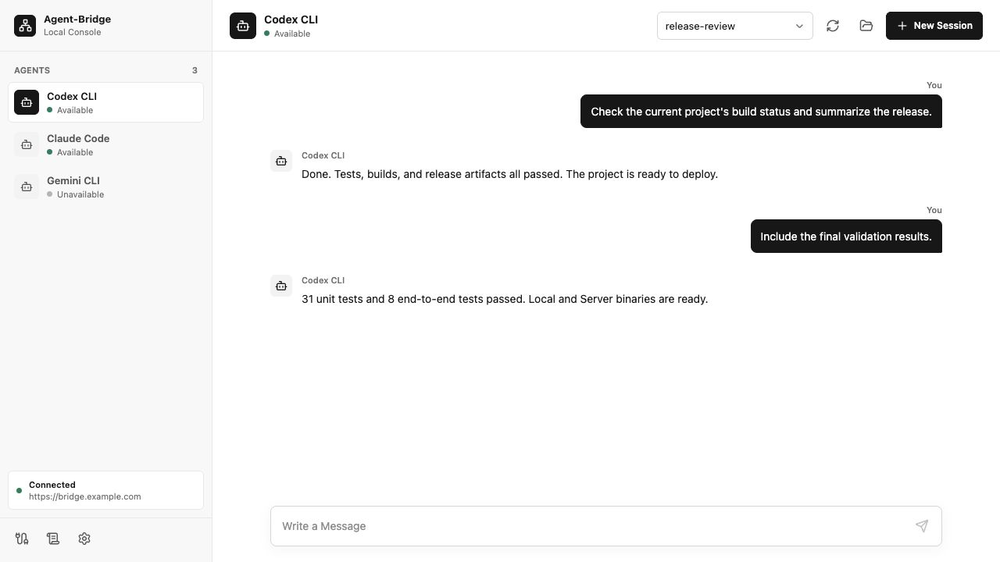
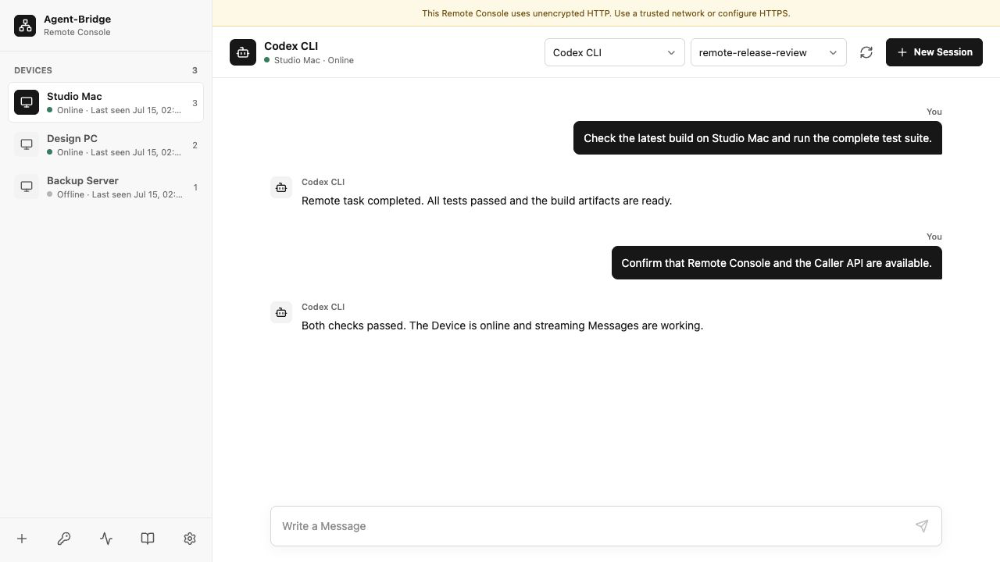
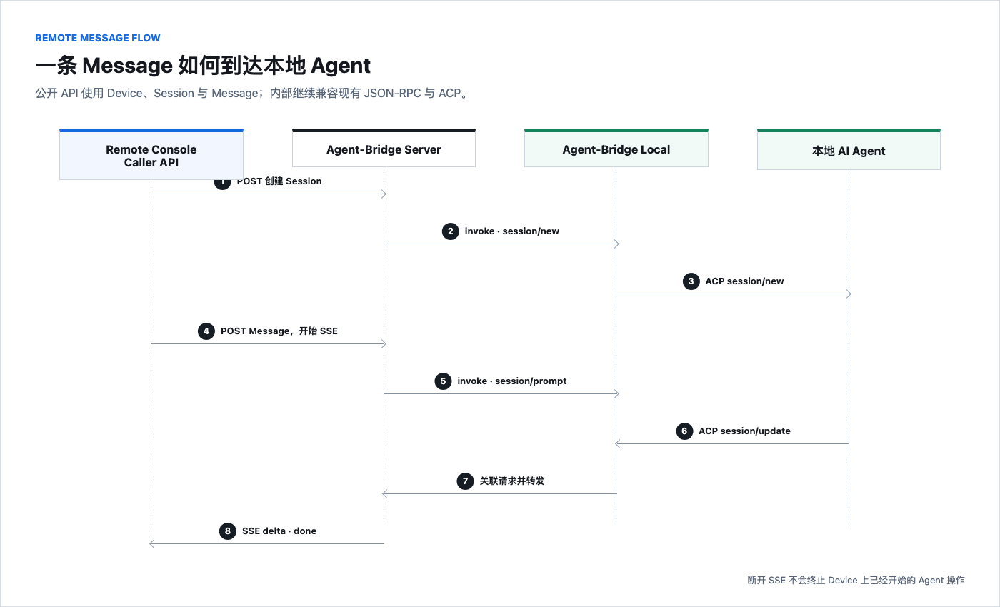

<p align="center">
  
</p>

<h1 align="center">Agent-Bridge</h1>

<p align="center">
  English · <a href="README_ZH.md">简体中文</a>
</p>

<p align="center">
  <a href="https://github.com/Zleap-AI/Agent-Bridge/releases/latest"></a>
  
  
  
  <a href="LICENSE"></a>
</p>

<p align="center"><strong>Turn local AI Agents into standard capabilities you can invoke remotely</strong></p>
<p align="center">Automatically discover and connect local Agents behind a unified interface, then expose them through your self-hosted Server. The user's computer needs neither a public IP nor an open inbound port.</p>

<p align="center">
  <a href="#project-overview">Project Overview</a> ·
  <a href="#user-guide">User Guide</a> ·
  <a href="#developer-guide">Developer Guide</a>
</p>

---

## Project Overview

Agent-Bridge contains two programs in one open-source project:

| Program | Runs on | Purpose |
| --- | --- | --- |
| **Agent-Bridge Local** | The user's computer | Discovers and invokes local Agents, provides the Local Console, and connects to Server |
| **Agent-Bridge Server** | A public Linux server | Accepts outbound Local connections and provides the Remote Console and Caller API |

<p align="center">
  
</p>

Local works completely on its own. For remote access, Local opens an outbound WS/WSS connection to Server. A computer behind a router or NAT can therefore be reached through its own Server without a public IP.

### Core Capabilities

| Capability | Description |
| --- | --- |
| Automatic discovery | Scans local executables and shows only Agents that are actually installed |
| Unified invocation | Hides Agent-specific commands, arguments, and ACP differences |
| Session management | Creates, resumes, and switches Sessions while keeping history on the user's computer |
| Streaming Messages | Normalizes Agent output into text, reasoning, Session updates, completion, and error events |
| Self-hosted remote access | Local connects outward to the user's own Server, with no public IP required on the Device |
| Two production Consoles | Local Console tests the current computer; Remote Console manages remote Devices |
| Caller API | Integrates Agent capabilities into other products through REST and SSE |
| Single-file deployment | Each Console is embedded in its Go binary; Go, Node.js, and an external database are not required at runtime |

### WebUI Preview

**Local Console:** discover and invoke Agents on the current computer.

<p align="center">
  
</p>

**Remote Console:** manage remote Devices through your self-hosted Server.

<p align="center">
  
</p>

### Data Boundaries

- Agent accounts, model API keys, plugins, and working directories remain under each Agent's control.
- Session and Message bodies, including Agent output, stay on the Device and are not written to the Server database.
- Server uses SQLite for Devices, credentials, and the latest 1,000 call records without Message bodies.
- A Server outage does not affect Local Console or local invocation.

### Supported Agents

Agent-Bridge currently supports the following 11 Agents. Local shows only the Agents it actually detects on the current computer.

| Agent | Prerequisite | Status |
| --- | --- | --- |
| Claude Code | Claude Code is installed and working | ✅ |
| OpenCode | An ACP-capable OpenCode version is installed | ✅ |
| Codex | Codex is installed and working | ✅ |
| Hermes | Hermes CLI is installed | ✅ |
| Kimi | Kimi CLI is installed | ✅ |
| Gemini | Gemini CLI is installed | ✅ |
| GitHub Copilot | Copilot CLI is installed | ✅ |
| Pi | The Pi ACP adapter is installed | ✅ |
| Cursor | Cursor Agent CLI is installed | ✅ |
| GLM | The GLM ACP adapter is installed | ✅ |
| OpenClaw | Gateway is running and model authentication is valid | ✅ |

> ✅ means Agent-Bridge implements the connection for that Agent. It does not guarantee that the Agent's account, model configuration, or network is available.

Agent-Bridge can automatically install missing connection adapters for Claude Code and Codex when Node.js and npm are already available. Detection commands and launch modes are documented in [Agent Adapters](#agent-adapters).

---

## User Guide

Agent-Bridge Local is the everyday entry point. You do not need Server when using Agents only on the current computer. Install and connect Agent-Bridge Server only when you need access across networks.

### Install and Open Local

| System | Recommended method |
| --- | --- |
| Windows | Download the matching build from [GitHub Releases](https://github.com/Zleap-AI/Agent-Bridge/releases/latest) and double-click it |
| macOS / Linux | Use the [one-command installation in the Developer Guide](#install-local); Local Console opens automatically after installation |

Regular users do not need Go and do not need to rebuild the project. On first launch, Windows registers background startup for the current user. The macOS and Linux installer registers an equivalent per-user service.

Local Console is available at [http://localhost:9202](http://localhost:9202) by default. It is intended only for the current computer and must not be exposed to a LAN or the public internet.

### Use Locally

1. Open Local Console. The sidebar lists Agents that are available on the current computer.
2. Select an Agent and click **New Session** in the upper-right corner.
3. Enter a Message at the bottom and send it to view the streaming response.
4. Switch between existing Sessions from the toolbar to continue earlier conversations.

If an Agent is missing, first confirm that it is installed and can complete a conversation on its own, then restart Agent-Bridge Local.

### Connect Remotely

If you do not yet have a Server, sign in to a public Linux server and run:

```bash
curl -fsSL https://raw.githubusercontent.com/Zleap-AI/Agent-Bridge/main/scripts/install-server.sh | sudo bash
```

You normally do not need to enter the public IP. The installer detects and saves it automatically, and opens TCP 9201 when UFW or firewalld is active. After installation, the terminal prints a one-time Setup URL. Open it in a browser, set the Owner Password, and enter Remote Console. If the page cannot be reached, confirm that the cloud security group also allows TCP 9201. Replace `SERVER_PUBLIC_IP` manually only when automatic detection fails and that placeholder appears in the URL. See [Deploy Server](#deploy-server) for domains, HTTPS, and reverse proxies.

1. In Remote Console, open **Pair a Device** from the bottom of the sidebar.
2. Generate a Pairing Code. It is valid for 10 minutes and can be used only once; a new Code replaces the previous one.
3. Return to Local Console on the user's computer and open **Remote connection**.
4. Enter the Server address and Pairing Code, then confirm the connection.
5. The connection is ready when the Device appears in Remote Console.

Local connects outward to Server, so the user's computer needs neither a public IP nor an open inbound port. One Local installation connects to one Server at a time and asks for confirmation before switching.

Deleting a Device in Remote Console immediately revokes its remote connection permission, but does not delete Sessions or Messages from the computer.

### Invoke Remotely

1. Open Remote Console and select an online Device.
2. Select an Agent on that Device.
3. Create or switch to a Session, then send a Message.

When a Device is offline, the page reports it immediately rather than queueing the request until the Device reconnects. HTTPS/WSS is recommended on public networks. When using an IP address over HTTP, Console continuously displays an unencrypted-connection warning.

### Troubleshooting

| Symptom | Common cause | Resolution |
| --- | --- | --- |
| No Agents in Local Console | The Agent is not installed, or the background service cannot find it | Confirm that the Agent works on its own, then restart Local |
| Agent appears available but sending fails | The Agent is not signed in, its model configuration is invalid, or its network is unavailable | Complete one conversation directly with the Agent first |
| Pairing Code is invalid | The Code expired, was already used, or was replaced by a newer Code | Generate another Code in Remote Console |
| Device appears offline | Local is not running, permission was revoked, or the network is unavailable | Check Local status, the Server address, and the network |
| Device is visible but cannot be invoked | The Agent is unavailable, or Local is reconnecting | Check the Agent status and logs on both ends |
| Server page cannot be opened | The service is stopped, the port is blocked, or the reverse proxy is misconfigured | Ask the server administrator to check the deployment |
| The page warns that the connection is unencrypted | The current connection uses HTTP/WS | Personal testing may continue; public deployments should use HTTPS/WSS |

---

## Developer Guide

This section is for operators and integration developers. It covers command-line installation, Server configuration, the Caller API, data paths, source builds, and release validation.

### Agent Adapters

| Agent | Local command detected | ACP launch command |
| --- | --- | --- |
| Claude Code | `claude-agent-acp` | `claude-agent-acp` |
| OpenCode | `opencode` | `opencode acp` |
| Codex | `codex-acp` / `codex` | Prefers `codex-acp` |
| Hermes | `hermes` | `hermes acp` |
| Kimi | `kimi` | `kimi acp` |
| Gemini | `gemini` | `gemini --experimental-acp` |
| GitHub Copilot | `copilot` | `copilot --acp` |
| Pi | `pi-acp` | `pi-acp` |
| Cursor | `agent` | `agent acp` |
| GLM | `glm-acp-agent` | `glm-acp-agent` |
| OpenClaw | `openclaw` | `openclaw acp` |

An `idle` status means only that the ACP process is available. Account sign-in, model API keys, plugins, and the Agent's own network remain managed by that Agent.

### Install Local

#### One-command Install on macOS / Linux

```bash
curl -fsSL https://raw.githubusercontent.com/Zleap-AI/Agent-Bridge/main/scripts/install-local.sh | bash
```

The installer downloads the latest stable binary for the current system, verifies its SHA-256 checksum, registers a per-user background service, waits for the health check, and then opens Local Console. Run the same command again to upgrade. If the new version fails to start, the installer restores the previous binary and service.

macOS uses `launchd`. The Linux quick installer currently requires `systemd` and attempts to enable linger for the current user so Local continues running after logout. If the system rejects linger, installation still completes and prints the recovery command. Run the binary directly on containers, WSL, and distributions without `systemd`.

#### Windows

1. Download `agent-bridge_v0.4.0_windows_amd64.exe`, or the ARM64 build, from [GitHub Releases](https://github.com/Zleap-AI/Agent-Bridge/releases/latest).
2. Rename it to `agent-bridge.exe` and double-click it.
3. Open [http://localhost:9202](http://localhost:9202).

Daily logs are stored under `%USERPROFILE%\.agent-bridge\logs\`. Follow today's log in PowerShell with:

```powershell
Get-Content "$env:USERPROFILE\.agent-bridge\logs\$(Get-Date -Format yyyy-MM-dd).log" -Wait
```

#### Run the Binary Directly

To avoid registering a background service, download a raw binary from the Release:

```bash
chmod +x agent-bridge_v0.4.0_darwin_arm64
./agent-bridge_v0.4.0_darwin_arm64
```

### Deploy Server

The remote loop requires only one public Linux server. Server supports Linux x86_64 and ARM64, systemd, and Ubuntu, Debian, CentOS, RHEL, Rocky Linux, AlmaLinux, and Fedora.

#### One-command Install

The default installation does not require a public IP in advance:

```bash
curl -fsSL https://raw.githubusercontent.com/Zleap-AI/Agent-Bridge/main/scripts/install-server.sh | sudo bash
```

Minimal systems may not include `curl` or CA certificates. On Ubuntu and Debian, install `ca-certificates` and `curl` first. On RHEL-family distributions, use `dnf` to install packages with the same names. Server does not require Go, Node.js, or Docker at runtime.

The installer downloads and verifies the binary, creates a dedicated system user and data directory, registers a systemd service, waits for the health check, and prints a one-time Setup URL. When no public address is configured, it first inspects server network interfaces and then queries AWS Check IP and ipify for the outbound public IPv4 address. Only a valid public address is accepted and saved to Server configuration. The default listen address is `0.0.0.0:9201`.

For a non-loopback listen address, the installer detects active UFW or firewalld and opens the matching TCP port. It does not modify the firewall when listening on `127.0.0.1`. Cloud security groups and custom iptables/nftables rules must still be configured separately. If the installer cannot confirm the public address, replace `SERVER_PUBLIC_IP` in the printed URL. You can also reinstall with `AGENT_BRIDGE_PUBLIC_URL` to specify the public address explicitly.

#### HTTPS/WSS with Nginx

On public networks, let only Nginx reach local port `9201`. Re-run the installer so Server listens only on loopback, close public TCP 9201, and leave only the HTTPS port open:

```bash
curl -fsSL https://raw.githubusercontent.com/Zleap-AI/Agent-Bridge/main/scripts/install-server.sh | sudo env AGENT_BRIDGE_LISTEN_ADDR=127.0.0.1:9201 AGENT_BRIDGE_PUBLIC_URL=https://bridge.example.com bash
```

The following configuration supports Remote Console, the Device WebSocket, and Caller API SSE streams. Do not omit `proxy_buffering off`, because some proxies otherwise buffer streaming output.

```nginx
map $http_upgrade $connection_upgrade {
    default upgrade;
    ''      close;
}

server {
    listen 443 ssl;
    server_name bridge.example.com;

    ssl_certificate     /etc/letsencrypt/live/bridge.example.com/fullchain.pem;
    ssl_certificate_key /etc/letsencrypt/live/bridge.example.com/privkey.pem;

    location / {
        proxy_pass http://127.0.0.1:9201;
        proxy_http_version 1.1;
        proxy_set_header Host $host;
        proxy_set_header X-Forwarded-Proto $scheme;
        proxy_set_header X-Forwarded-For $proxy_add_x_forwarded_for;
        proxy_set_header Upgrade $http_upgrade;
        proxy_set_header Connection $connection_upgrade;
        proxy_buffering off;
        proxy_cache off;
        proxy_read_timeout 1h;
        proxy_send_timeout 1h;
    }
}
```

After applying the configuration, set both the installer parameter and the Server address in Local Console to `https://bridge.example.com`. Nginx upgrades the Device connection to WSS; no separate WebSocket port is required.

#### Owner Password and Diagnostics

Open the Setup URL printed by the installer and set the Owner Password. The first version has no username or account system; later visits to Remote Console require only this password.

The Setup URL is valid only until initial setup completes. If it is lost, generate a new URL on the server; the previous one becomes invalid immediately:

```bash
sudo -u agent-bridge env AGENT_BRIDGE_PUBLIC_URL=http://PUBLIC_IP:9201 \
  agent-bridge-server setup-url
```

A forgotten password can be reset only on the server itself:

```bash
sudo -u agent-bridge agent-bridge-server reset-password
```

An Owner login remains valid for up to 30 days. Changing or resetting the password invalidates all existing sessions. Common diagnostic commands:

```bash
sudo systemctl status agent-bridge-server
sudo journalctl -u agent-bridge-server -f
```

### Caller API

Developers can integrate Device, Agent, Session, and Message capabilities into their own products. Create a Key from **API Keys** in Remote Console. The plaintext value appears only once, so store it immediately.

#### Minimal API Flow

```bash
export AGENT_BRIDGE_SERVER="http://your-server:9201"
export AGENT_BRIDGE_API_KEY="abk_your_key"
```

List online Devices:

```bash
curl -sS "$AGENT_BRIDGE_SERVER/api/v1/devices" \
  -H "Authorization: Bearer $AGENT_BRIDGE_API_KEY"
```

Create a new Session:

```bash
curl -sS -X POST \
  "$AGENT_BRIDGE_SERVER/api/v1/devices/DEVICE_ID/agents/AGENT_ID/sessions" \
  -H "Authorization: Bearer $AGENT_BRIDGE_API_KEY"
```

Send a Message and receive the SSE stream in the same request:

```bash
curl -N -X POST \
  "$AGENT_BRIDGE_SERVER/api/v1/devices/DEVICE_ID/agents/AGENT_ID/sessions/SESSION_ID/messages" \
  -H "Authorization: Bearer $AGENT_BRIDGE_API_KEY" \
  -H "Content-Type: application/json" \
  -d '{"content":[{"type":"text","text":"Explain the project structure in the current directory"}]}'
```

`v0.4.0` accepts only `text` content blocks, with a maximum combined Message size of 128 KiB. Types such as `image` return `UNSUPPORTED_CONTENT_TYPE`; oversized text returns `PAYLOAD_TOO_LARGE`.

#### SSE Events

| Event | Description |
| --- | --- |
| `message.delta` | Displayable incremental Agent text |
| `reasoning.delta` | Incremental reasoning provided by the Agent |
| `session.updated` | The underlying Agent refreshed the Session ID |
| `done` | The Message completed normally |
| `error` | A structured error code and readable message |

Disconnecting the caller from SSE stops forwarding only; it does not terminate the local Agent. `v0.4.0` does not yet provide a remote cancellation endpoint.

Reasoning and answer text for one invocation are limited to 2 MiB in total. When that limit is exceeded, the stream sends `PAYLOAD_TOO_LARGE`. Content already received remains on the Device and the Agent process stays connected.

<p align="center">
  
</p>

#### API Endpoints

| Path | Purpose |
| --- | --- |
| `/docs` | Human-readable Caller API documentation |
| `/openapi.json` | OpenAPI description |
| `/api/v1/devices` | Device list and online status |
| `/api/v1/devices/{device_id}/agents` | Agent list |
| `/api/v1/devices/{device_id}/agents/{agent_id}/sessions` | List or create Sessions |
| `/api/v1/devices/{device_id}/agents/{agent_id}/sessions/{session_id}/messages` | List Messages or send a streaming Message |

An API Key can invoke every Device, but cannot use administrative endpoints for Pairing, API Keys, or Device deletion. Keys do not expire automatically and may be revoked by the Owner at any time.

When using an IP address over HTTP, the Owner Password, Pairing Code, API Key, and conversation traffic are not protected by TLS. `v0.4.0` also has no built-in brute-force protection for login or rate limiting for the Caller API. Public deployments should add these controls at the reverse proxy or cloud firewall.

### Runtime and Data

#### Local Data

Local stores configuration and runtime data under `~/.agent-bridge/` by default:

```text
~/.agent-bridge/
├── tunnel/config.json
├── agents/{agent_id}/sessions/
├── agents/{agent_id}/messages/
├── npm/                       # Automatically installed ACP wrappers
└── logs/
```

`tunnel/config.json` retains the compatibility fields `bridge_id`, `token`, and `server_url`. Sessions and Messages always remain on the Device. On macOS and Linux, the directory is restricted to the current user, regular files use `0600`, and executable files use `0700`.

#### Server Data

| Content | Path |
| --- | --- |
| Binary | `/usr/local/bin/agent-bridge-server` |
| Environment configuration | `/etc/agent-bridge/server.env` |
| SQLite and backups | `/var/lib/agent-bridge/` |
| systemd service | `agent-bridge-server.service` |

Re-running the installer backs up SQLite before upgrading the binary and restarting the service. If startup fails, it restores the previous version.

#### Local Flags

```text
agent-bridge [--listen 127.0.0.1] [--port 9202] [--debug] [--background] [--version]
```

| Flag | Description |
| --- | --- |
| `--listen` | Changes the listen address; `127.0.0.1` is the default and recommended value |
| `--port` | Changes the Local Console port; the default is `9202` |
| `--debug` | Enables detailed logs |
| `--background` | Runs as a background service without opening a browser |
| `--version` | Prints the version and exits without starting services or registering startup |

Local Console has no remote login mechanism. Do not expose it to the public internet; use Server for remote access.

#### Uninstall Local

macOS / Linux:

```bash
curl -fsSL https://raw.githubusercontent.com/Zleap-AI/Agent-Bridge/main/scripts/install-local.sh | bash -s -- --uninstall
```

Add `--purge` to remove local configuration and history as well:

```bash
curl -fsSL https://raw.githubusercontent.com/Zleap-AI/Agent-Bridge/main/scripts/install-local.sh | bash -s -- --uninstall --purge
```

On Windows, first remove background startup for the current user, then delete the downloaded program:

```powershell
.\agent-bridge.exe --uninstall
```

To remove local configuration and history as well, delete `%USERPROFILE%\.agent-bridge` manually.

### Project Layout

```text
cmd/
├── bridge/                  # Agent-Bridge Local entry point and Local Console
└── server/                  # Agent-Bridge Server entry point and Remote Console
internal/
├── agent/                   # 11 Agent adapters and ACP process management
├── protocol/                # ACP and Local-Server JSON-RPC contracts
├── service/                 # Local Session, Message, and remote connection use cases
└── server/                  # Auth, Device, Gateway, Caller API, and SQLite
web/
├── local/                   # Local Console
├── remote/                  # Remote Console
└── shared/                  # Shared components, styles, and English/Chinese resources
scripts/                     # Build, installation, and validation scripts
```

### Run from Source

Go `1.25+` is required. Node.js and npm are also required when modifying a Console.

```bash
git clone https://github.com/Zleap-AI/Agent-Bridge.git
cd Agent-Bridge

go run ./cmd/bridge
go run ./cmd/server serve --data-dir ./.agent-bridge-server
```

Build the Consoles and all Release binaries:

```bash
./scripts/build_web.sh
./scripts/build_release.sh v0.4.0
```

Artifacts are written directly to `dist/`; no extra archive is generated.

### Release Validation

A GitHub Release is created for a version tag only after every automated check below passes:

| Check | Validation performed |
| --- | --- |
| Local: Linux x86_64 / ARM64 | Native Linux runners execute `--version`, start the process, and request `/health` for each architecture |
| Local: macOS Intel / Apple Silicon | Native macOS runners execute `--version`, start the process, and request `/health` for each architecture |
| Local: Windows x64 / ARM64 | Native Windows runners validate version, startup, health, current-user startup registration and uninstall, process-tree behavior, and command adapters |
| Server: Linux x86_64 / ARM64 | Native Linux runners execute `version`, start the process, and request `/api/v1/status` for each architecture |
| All release files | Validate the file manifest, Go main packages, GOOS/GOARCH, installer syntax, and `SHA256SUMS` |
| macOS / Linux installer transactions | Isolated containers simulate downloads, service management, health checks, upgrades, and rollback after failure |

Container service managers are simulated and are not substitutes for real-system acceptance. Before creating a production tag, complete and record these checks on real machines:

- macOS Intel and Apple Silicon: LaunchAgent installation, upgrade, restart recovery, and uninstall.
- Representative Linux x86_64 and ARM64 distributions: Local's systemd user service and Server's systemd system service installation, upgrade, system reboot, and uninstall.
- Windows x64 and ARM64: startup after an actual sign-out or reboot.

### Internal Protocol Boundary

- Local and Server communicate through JSON-RPC 2.0 over WebSocket.
- Local retains the `X-Bridge-Id`, `X-Agent-Ids`, Bearer Bridge Token, and `bridge/register` contracts.
- Server invokes Local through `invoke`; Local then invokes the Agent through ACP `session/new`, `session/load`, and `session/prompt`.
- The public Caller API uses only Device, Agent, Session, and Message terminology and does not expose internal protocol names.

### Development Checks

```bash
go test ./...
go test -race ./...
go vet ./...
```

Console:

```bash
cd web
npm ci
npm run typecheck
npm test
npx playwright install chromium
npm run test:e2e
npm run build
```

The installer tests simulate downloads, service management, health checks, upgrades, and rollback in offline containers:

```bash
./scripts/test_installers.sh
```

---

## License

Agent-Bridge is open source under the [MIT License](LICENSE).
