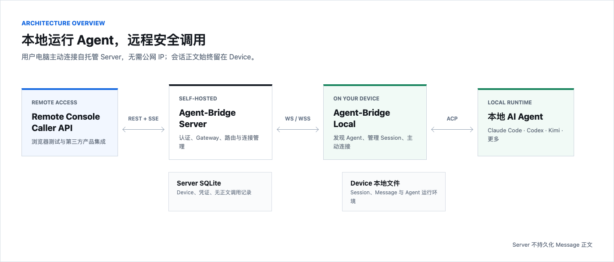
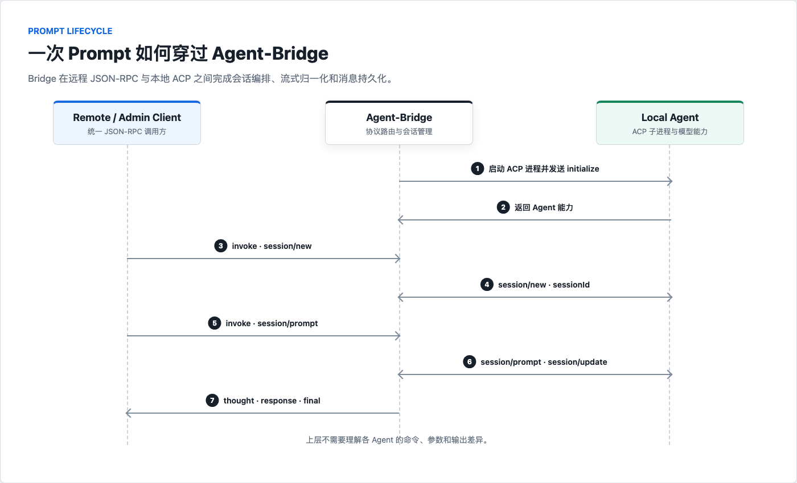

<p align="center">
  
</p>

<h1 align="center">Agent-Bridge</h1>

<p align="center">
  <a href="https://github.com/Zleap-AI/Agent-Bridge/releases/latest"></a>
  
  
  
  <a href="LICENSE"></a>
</p>

<p align="center"><strong>把本地 AI Agent 变成可远程调用的标准能力</strong></p>
<p align="center">自动发现本机 Agent，通过 Agent Client Protocol（ACP）管理会话，再以统一的 WebSocket 接口连接远程服务与本地调试界面。</p>

<p align="center">
  <a href="#项目介绍">项目介绍</a> ·
  <a href="#支持的-agent">支持的 Agent</a> ·
  <a href="#快速开始">快速开始</a> ·
  <a href="#用户指南">用户指南</a> ·
  <a href="#开发者指南">开发者指南</a> ·
  <a href="#许可证">许可证</a>
</p>

---

## 项目介绍

### 一分钟了解

`Agent-Bridge` 是运行在用户电脑上的本地桥接服务，下文简称 Bridge。它负责发现已安装的 AI Agent、启动对应的 ACP 进程、管理会话与消息，并把不同 Agent 的能力统一成一套 JSON-RPC 接口。

<p align="center">
  
</p>

它不替代 Agent，也不代理模型本身。模型账号、API Key、插件与工作目录仍由各 Agent 自己管理；Bridge 只负责发现、连接、调用和统一返回结果。

### 核心能力

| 能力 | 说明 |
| --- | --- |
| 自动发现 | 扫描本机可执行文件，只注册实际安装的 Agent |
| 统一启动 | 按各 Agent 的 ACP 启动方式创建并管理子进程 |
| 统一调用 | 用 `invoke` 封装 `session/new`、`session/load`、`session/prompt` 等操作 |
| 流式响应 | 将不同 Agent 的 ACP 更新归一化为 `thought`、`response`、`final`、`error` |
| 会话持久化 | 保存会话索引和消息，Bridge 重启后仍可查看历史记录 |
| 远程连接 | 主动连接远程 WebSocket 服务，注册 Bridge 与本机 Agent 列表及状态 |
| 本地管理 | 提供健康检查、Agent 状态、会话 API 和两个浏览器测试界面 |

### 两种使用方式

| 模式 | 适合场景 | 是否需要远程服务 |
| --- | --- | --- |
| 本地调试 | 在浏览器中直接测试本机 Agent、会话和流式回复 | 不需要 |
| 远程连接 | 从远程工作台或其他客户端调用这台电脑上的 Agent | 需要配置 `server_url` 和凭证 |

即使远程服务暂时不可用，Bridge 的本地管理接口和测试界面仍会继续运行。

---

## 支持的 Agent

代码中已经实现以下 11 个 Agent 适配器：

| Agent | 检测的本地命令 | ACP 启动方式 | 使用前提 | 状态 |
| --- | --- | --- | --- | --- |
| Claude Code | `claude-agent-acp` | `claude-agent-acp` | 已安装 `claude`；缺少适配器时可自动安装 | ✅ |
| OpenCode | `opencode` | `opencode acp` | 已安装支持 ACP 的 OpenCode | ✅ |
| Codex | `codex-acp` / `codex` | 优先使用 `codex-acp` | 已安装 Codex；缺少适配器时可自动安装 | ✅ |
| Hermes | `hermes` | `hermes acp` | 已安装 Hermes CLI | ✅ |
| Kimi | `kimi` | `kimi acp` | 已安装 Kimi CLI | ✅ |
| Gemini | `gemini` | `gemini --experimental-acp` | 已安装 Gemini CLI | ✅ |
| GitHub Copilot | `copilot` | `copilot --acp` | 已安装 Copilot CLI | ✅ |
| Pi | `pi-acp` | `pi-acp` | 已安装 Pi ACP 适配器 | ✅ |
| Cursor | `agent` | `agent acp` | 已安装 Cursor Agent CLI | ✅ |
| GLM | `glm-acp-agent` | `glm-acp-agent` | 已安装 GLM ACP 适配器 | ✅ |
| OpenClaw | `openclaw` | `openclaw acp` | Gateway 正常运行且模型鉴权有效 | ✅ |

> ✅ 表示 Bridge 已实现对应的发现、启动与 ACP 连接代码。启动时只会显示当前电脑实际检测到的 Agent。界面中的 `idle` 表示 ACP 进程状态正常，不代表该 Agent 的模型账号或 API Key 一定可用。

Claude Code 与 Codex 的 ACP 包装器只会在检测到原生 CLI、但未找到包装器时尝试自动安装。自动安装需要本机已有可用的 Node.js 与 npm 环境。

---

## 快速开始

### 1. 下载可执行文件

普通用户直接使用已经构建好的可执行文件，**不需要安装 Go，也不需要重新构建**。

1. 打开 [GitHub Releases](https://github.com/Zleap-AI/Agent-Bridge/releases/latest)。
2. 下载与当前操作系统及 CPU 架构匹配的文件。

| 系统 | CPU | 可执行文件 |
| --- | --- | --- |
| Windows | x64 | `agent-bridge_v0.3.0_windows_amd64.exe` |
| Windows | ARM64 | `agent-bridge_v0.3.0_windows_arm64.exe` |
| macOS | Intel | `agent-bridge_v0.3.0_darwin_amd64` |
| macOS | Apple Silicon | `agent-bridge_v0.3.0_darwin_arm64` |
| Linux | x64 | `agent-bridge_v0.3.0_linux_amd64` |
| Linux | ARM64 | `agent-bridge_v0.3.0_linux_arm64` |

需要校验文件完整性时，下载同一版本中的 `SHA256SUMS`。

### 2. 准备 Agent

1. 确认本机至少安装了一个[受支持的 Agent](#支持的-agent)。
2. 确认该 Agent 已完成登录或模型 API 配置。

下载后建议将文件改成下面的名称，后续命令均使用该短名称：

| 系统 | 文件 |
| --- | --- |
| Windows | `agent-bridge.exe` |
| macOS / Linux | `agent-bridge` |

> `git clone` 得到的是项目源码，不是已构建的可执行文件。只有修改代码或手上没有匹配的可执行文件时，才需要按照[从源码构建](#从源码构建)安装 Go 并编译。

### 3. 启动 Bridge

Windows 可以双击 `agent-bridge.exe`，也可以在 PowerShell 中运行：

```powershell
.\agent-bridge.exe
```

macOS / Linux：

```bash
chmod +x agent-bridge
./agent-bridge
```

Bridge 会依次完成：

1. 扫描本机 Agent。
2. 启动检测到的 ACP 进程并握手。
3. 尝试连接配置的远程 WebSocket 服务。
4. 在 `9202` 端口启动本地管理服务。

如果日志出现 `TunnelService 启动失败（远程服务可能未就绪）`，但本地页面可以打开，这是未配置远程连接时的正常现象，不影响本地测试。

### 4. 在浏览器中测试

启动后直接打开 [http://localhost:9202](http://localhost:9202)，或者访问：

- [远程连接模拟界面](http://localhost:9202/test_remote.html)：模拟远程客户端的完整调用链路
- [ACP 测试界面](http://localhost:9202/test_acp.html)：直接测试 Agent 与 ACP 会话

推荐先使用远程连接模拟界面：

1. 页面会自动连接 `ws://localhost:9202/ws/admin`；未连接时点击“连接”。
2. 在 Agent 下拉框中选择一个状态正常的 Agent。
3. 点击 `New Session` 创建会话。
4. 输入 Prompt，点击“发送 Prompt”。
5. 需要恢复历史时，在会话列表中选择会话并点击 `Load Session`。
6. 在“对话”和“日志”标签中查看历史、流式回复与协议消息。

快速确认服务状态：

```bash
curl http://localhost:9202/health
curl http://localhost:9202/agents
```

---

## 用户指南

### 启动参数

```text
agent-bridge [--port 9202] [--debug]
```

| 参数 | 默认值 | 说明 |
| --- | --- | --- |
| `--port` | `9202` | 本地 Admin HTTP 与 WebSocket 端口 |
| `--debug` | 关闭 | 输出更详细的调试日志 |

示例：

```bash
./agent-bridge --port 9302 --debug
```

测试页面当前默认连接 `9202`，因此使用其他端口时需要通过自己的客户端调用，或同步调整页面中的 WebSocket 地址。

> 启动时 Bridge 会主动处理被占用的目标端口。不要把 `--port` 指向正在运行重要服务的端口；建议先确认该端口空闲。

### 连接远程服务

配置文件位置：

| 系统 | 路径 |
| --- | --- |
| macOS / Linux | `~/.agent-bridge/tunnel/config.json` |
| Windows | `%USERPROFILE%\.agent-bridge\tunnel\config.json` |

创建配置：

```json
{
  "bridge_id": "your-bridge-id",
  "token": "your-access-token",
  "server_url": "wss://your-remote-server/ws"
}
```

只临时覆盖远程服务地址时可以使用环境变量：

```bash
AGENT_BRIDGE_SERVER_URL="wss://your-remote-server/ws" ./agent-bridge
```

配置文件中的 `admin_port` 和 `debug` 字段目前不会覆盖命令行行为。请分别使用 `--port` 和 `--debug`，避免配置看似生效、实际仍使用默认值。

### 会话与消息存储

Bridge 将运行数据保存在用户目录：

```text
~/.agent-bridge/agents/
└── {agent_id}/
    ├── sessions/
    │   └── {session_id}.json
    └── messages/
        └── {session_id}.json
```

- `sessions` 保存会话索引和恢复所需信息。
- `messages` 保存用户消息、Agent 回复与时间信息。
- 删除这些文件会清除 Bridge 的本地历史记录，但不会卸载 Agent。

### 日常维护

| 操作 | 方法 |
| --- | --- |
| 停止 Bridge | 终端运行时按 `Ctrl+C`；双击启动时关闭对应窗口 |
| 升级 | 下载新版本可执行文件并替换旧文件；配置与会话记录会保留 |
| 查看日志 | 默认查看终端输出；使用 `--debug` 时同时写入 `~/.agent-bridge/logs/YYYY-MM-DD.log` |
| 清除本地历史 | 停止 Bridge 后删除 `~/.agent-bridge/agents/` |

### 常见问题

| 现象 | 常见原因 | 处理方式 |
| --- | --- | --- |
| 页面没有 Agent | 本机未安装受支持 CLI，或命令不在 `PATH` | 在同一终端运行对应命令确认可执行，再重启 Bridge |
| Agent 显示 `idle`，发送仍失败 | ACP 已启动，但模型账号、API Key 或网络不可用 | 先直接运行该 Agent CLI，确认能完成一次对话 |
| 启动时提示远程连接失败 | 默认地址 `ws://localhost:9201/ws` 没有服务 | 本地调试可忽略；需要远程连接时配置正确的 `server_url` |
| `session/new` 失败 | Agent 尚未完成 ACP 握手，或工作目录不可访问 | 查看 `--debug` 日志，确认 Agent 命令和当前目录 |
| `session/load` 返回 `-32602` | 某些 ACP 实现要求同时传入 `cwd` 与 `mcpServers` | 使用 Bridge 的 `invoke` 接口，或在自定义请求中补齐两个字段 |
| Hermes 无法连接 | Hermes 版本不支持 `acp` 子命令 | 升级 Hermes，并先手动执行 `hermes acp` 验证 |
| OpenClaw 能建会话但 Prompt 失败 | Gateway 未运行，或模型提供商鉴权无效 | 检查 Gateway、provider 配置和 API Key |
| 页面打不开 | Bridge 未运行、端口被其他程序占用或改了 `--port` | 查看启动日志，并访问实际 Admin 端口 |

### 本地安全说明

当前 Admin 服务面向本地开发调试：默认监听所有网卡、WebSocket 不校验 Origin，也没有单独的 Admin 鉴权。不要把 `9202` 端口直接暴露到公网；在共享网络或服务器环境中，应使用防火墙限制访问范围。

---

## 开发者指南

### 系统边界

Bridge 同时维护两类连接：

<p align="center">
  
</p>

- **外部连接**：远程服务或本地 Admin 客户端通过 WebSocket 发送 JSON-RPC 2.0 消息。
- **内部连接**：Bridge 通过 Agent Client Protocol 使用子进程的 `stdin/stdout` 通讯，每行一个 JSON 对象。
- **持久化边界**：会话与消息由 Bridge 本地保存，避免界面历史完全依赖 Agent 是否支持加载。

### 目录结构

```text
cmd/bridge/
├── main.go                 # 进程入口、服务装配与 Admin 路由
└── html/                   # 内嵌测试界面
internal/
├── agent/                  # Agent 发现、适配器、ACP 进程管理
├── infra/                  # 配置、日志、WebSocket、端口与进程基础设施
├── protocol/               # ACP 与远程 JSON-RPC 消息模型
├── service/                # 路由、Tunnel、会话和消息存储
└── types.go                # 共享类型
scripts/                    # 端到端与协议验证脚本
```

### 从源码构建

只有开发、调试源码或没有匹配的可执行文件时才需要这一步。源码构建要求 Go `1.25` 或更高版本。

macOS / Linux：

```bash
go version
go build -trimpath -o agent-bridge ./cmd/bridge
./agent-bridge
```

Windows PowerShell：

```powershell
go version
go build -trimpath -o agent-bridge.exe ./cmd/bridge
.\agent-bridge.exe
```

开发时也可以直接运行：

```bash
go run ./cmd/bridge
```

### 本地接口

| 地址 | 方法 | 用途 |
| --- | --- | --- |
| `/health` | `GET` | Bridge 版本、整体状态与 Agent 状态 |
| `/agents` | `GET` | 已发现 Agent 的详细信息 |
| `/api/sessions?agent_id=codex` | `GET` | 查询指定 Agent 的会话；不传 `agent_id` 时返回全部 |
| `/api/messages?agent_id=codex&session_id=...` | `GET` | 查询某个会话的本地消息 |
| `/ws/admin` | WebSocket | 本地 JSON-RPC 管理与调用入口 |
| `/test_acp.html` | `GET` | ACP 测试界面 |
| `/test_remote.html` | `GET` | 远程连接模拟界面 |

### 启动流程

1. 读取 `~/.agent-bridge/tunnel/config.json`，再应用受支持的环境变量覆盖。
2. `AgentRegistry.Discover` 根据操作系统和 `PATH` 创建可用适配器。
3. 并行启动已发现 Agent，完成 ACP `initialize` 握手。
4. `TunnelService` 连接远程服务；连接失败不会阻塞本地 Admin 服务。
5. Admin 服务提供 REST、WebSocket 与内嵌测试页面。

### 远程 WebSocket 协议

Bridge 连接远程服务时使用 JSON-RPC 2.0，并携带以下请求头：

| 请求头 | 说明 |
| --- | --- |
| `X-Bridge-Id` | Bridge 唯一标识 |
| `X-Agent-Ids` | 本机可用 Agent ID 列表 |
| `Authorization` | `Bearer <token>`，配置了 token 时发送 |

主要方法：

| 方法 | 方向 | 说明 |
| --- | --- | --- |
| `bridge/register` | Bridge → 远程服务 | 注册 Bridge、Agent 列表与状态 |
| `invoke` | 远程服务 → Bridge | 调用指定 Agent 的 ACP 方法 |
| `session/update` | Bridge → 远程服务 | 推送思考、正文、完成或错误事件 |
| `sessions/list` | 远程服务 → Bridge | 查询指定 Agent 的本地会话 |
| `sessions/messages` | 远程服务 → Bridge | 查询指定会话的本地消息 |
| `ping` / `pong` | 双向 | 心跳与连接存活检查 |

<details>
<summary>查看调用与流式更新示例</summary>

调用示例：

```json
{
  "jsonrpc": "2.0",
  "id": "req-001",
  "method": "invoke",
  "params": {
    "agent_id": "codex",
    "method": "session/prompt",
    "stream": true,
    "params": {
      "sessionId": "session-123",
      "prompt": [
        { "type": "text", "text": "解释这个项目的入口" }
      ]
    }
  }
}
```

流式更新示例：

```json
{
  "jsonrpc": "2.0",
  "method": "session/update",
  "params": {
    "request_id": "req-001",
    "type": "response",
    "content": {
      "text": "项目入口位于 cmd/bridge/main.go"
    }
  }
}
```

`invoke.params.stream` 为 `true` 时，Bridge 会通过 `session/update` 推送流式内容；省略或设为 `false` 时，会等待 Agent 完整响应后一次性返回结果。

`type` 可能为：

| 类型 | 含义 |
| --- | --- |
| `thought` | Agent 的思考或分析更新 |
| `response` | 可展示的正文增量 |
| `final` | 本次调用完成 |
| `error` | 调用失败 |
| `session_invalid` | 会话不可继续使用 |
| `session_refreshed` | Bridge 已刷新会话 |

</details>

### ACP 交互

Agent 进程启动后，Bridge 按照 [Agent Client Protocol](https://agentclientprotocol.com/) 发送 `initialize`。

<details>
<summary>查看 initialize 示例</summary>

```json
{
  "jsonrpc": "2.0",
  "id": 1,
  "method": "initialize",
  "params": {
    "protocolVersion": 1,
    "clientCapabilities": {}
  }
}
```

</details>

握手成功后，Bridge 使用这些核心方法：

| ACP 方法 | 用途 |
| --- | --- |
| `session/new` | 创建新会话，传入 `cwd` 和 `mcpServers` |
| `session/load` | 恢复已有会话，传入 `sessionId`、`cwd` 和 `mcpServers` |
| `session/prompt` | 向指定会话发送内容块 |
| `session/update` | Agent 主动推送流式内容、工具状态与结果 |

### 新增 Agent 适配器

新增支持时应保持适配器只负责 Agent 差异，不把远程连接协议逻辑带入 `internal/agent`：

1. 在 `internal/agent/` 新增适配器并实现 `Agent` 接口。
2. 定义稳定的 Agent ID、显示名称、命令发现和 ACP 启动参数。
3. 在 `registry.go` 及需要的平台注册表中加入发现规则。
4. 通过基础实现复用进程生命周期、JSON-RPC 编解码与状态管理。
5. 更新本 README 的支持列表，并运行 Go 检查和端到端脚本。

核心接口职责：

```go
type Agent interface {
    ID() string
    DisplayName() string
    Status() AgentStatus
    Start(ctx context.Context) error
    Stop(ctx context.Context) error
    Health(ctx context.Context) error
    Send(ctx context.Context, req *protocol.ACPMessage) (*protocol.ACPMessage, error)
    Stream(ctx context.Context, req *protocol.ACPMessage) (<-chan internal.StreamChunk, error)
    NewSession(ctx context.Context) (string, error)
    LoadSession(ctx context.Context, sessionID string) error
}
```

具体签名以 `internal/agent/interface.go` 为准。适配器应隐藏命令、参数、输出格式和 Agent 特有错误，让上层只依赖统一行为。

<details>
<summary><strong>错误码</strong></summary>

| 错误码 | 含义 |
| --- | --- |
| `-32700` | JSON 解析失败 |
| `-32601` | 未知方法 |
| `-32602` | 请求参数无效 |
| `-31001` | 未找到 Agent |
| `-31002` | Agent 启动失败 |
| `-31003` | Agent 不支持该方法 |
| `-31004` | 创建会话失败 |
| `-31005` | 加载会话失败 |
| `-31006` | 获取会话失败 |
| `-31007` | 发送 Prompt 失败 |
| `-31008` | Agent 返回错误 |
| `-31009` | 无法识别 Agent 响应 |

</details>

<details>
<summary><strong>连接策略</strong></summary>

| 项目 | 默认值 |
| --- | --- |
| Ping 间隔 | `30s` |
| 读取超时 | `60s` |
| 写入超时 | `10s` |
| 重连间隔 | `5s` |
| 重连次数 | 不限 |
| 单条消息上限 | `1 MiB` |

</details>

### 开发检查

```bash
go test ./...
go vet ./...
```

涉及 Agent 会话、流式消息或持久化行为时，还应在 Bridge 运行状态下执行：

```bash
python3.12 -m pip install websockets
python3.12 scripts/test_all_agents.py
```

脚本会验证当前发现 Agent 的会话创建、列表查询、Prompt、消息查询、会话加载和无效会话处理。完整 Prompt 测试仍依赖各 Agent 自己的登录状态、模型服务与网络。

---

`Agent-Bridge` 的目标是让上层只面对一套稳定协议，同时把每个 Agent 的安装方式、ACP 参数、会话差异和模型鉴权留在清晰的适配器边界内。

## 许可证

Agent-Bridge 基于 [MIT License](LICENSE) 开源。
